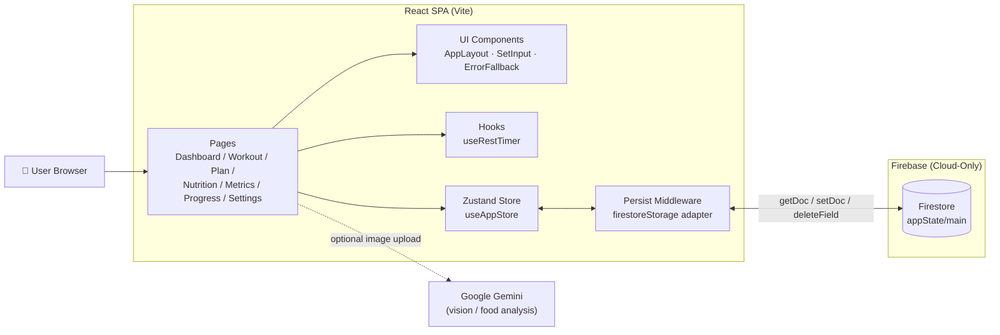
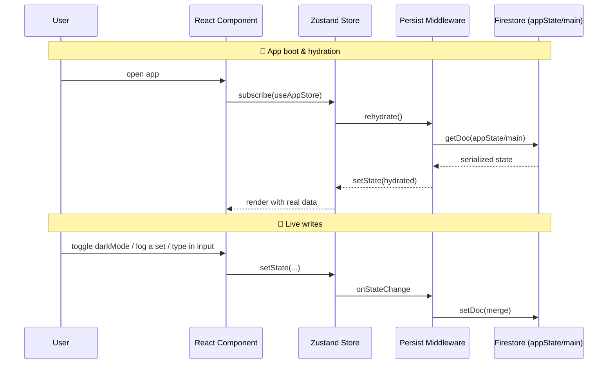
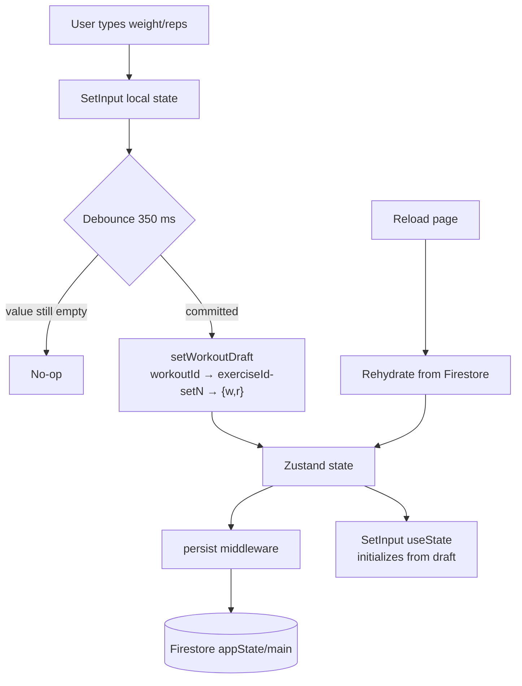
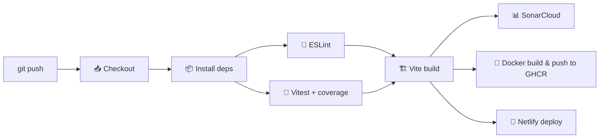

<div align="center">

# 💪 FitTracker

### A cloud-only, AI-assisted fitness tracker for body recomposition

**Track workouts • Log calories with AI • Monitor body metrics • See your progress**

[](https://github.com/utkarsh-gt7/mytrainer/actions/workflows/ci.yml)
[](https://mytrainer707.netlify.app)


[Live Demo](https://mytrainer707.netlify.app) · [Report Bug](https://github.com/utkarsh-gt7/mytrainer/issues) · [Request Feature](https://github.com/utkarsh-gt7/mytrainer/issues)

</div>

---

## 📑 Table of Contents

- [Overview](#-overview)
- [Features](#-features)
- [Design System](#-design-system)
- [High-Level Design](#-high-level-design)
- [Tech Stack](#-tech-stack)
- [Project Structure](#-project-structure)
- [Getting Started](#-getting-started)
- [Environment Variables](#-environment-variables)
- [How to Use](#-how-to-use)
- [Testing & Coverage](#-testing--coverage)
- [CI/CD Pipeline](#-cicd-pipeline)
- [Deployment](#-deployment)
- [Available Scripts](#-available-scripts)
- [Troubleshooting](#-troubleshooting)
- [Roadmap](#-roadmap)
- [License](#-license)

---

## 🌟 Overview

**FitTracker** is a modern, mobile-first fitness tracking Progressive Web App designed for serious recomposition goals. It combines a beautifully-designed workout UI with cloud-native persistence and AI-powered nutrition logging.

> 🔒 **Cloud-only persistence** — every piece of state (profile, plan, logs, drafts) lives in **Firebase Firestore** under a single document (`appState/main`). There is no local storage fallback, so your data follows you on every device you sign in from.

> ✍️ **Draft autosave** — in-progress set weights and reps are persisted in real time. Reload the page mid-workout and nothing is lost.

---

## ✨ Features

### 🏋️ Training
- **6-Day Push / Pull / Legs plan** pre-loaded and fully editable, with separate forearm-flexion and forearm-extension work, seated calf raise on Saturday, and quad volume tuned to MAV
- **Active workout flow** with timer, rest timer, and per-set logging
- **Mobile-safe set rows** — tick/edit/copy buttons never get clipped on small screens
- **Clever "copy previous set"** button — one tap to prefill weight and reps from the set above
- **Per-set editing** — change any logged set after saving, without losing your PRs
- **Re-open completed workouts** to amend anything on today's session
- **Automatic PR detection** and history
- **Previous Logs popup** on every expanded exercise card — surfaces your most recent prior session for that exercise (scans full history, so twice-a-week movements work), your all-time PR, a 5-session trend, and a **Smart Overload suggestion** powered by double-progression rules (hit top of range → +2.5 kg & reset reps; inside range → push +1 rep; missed floor → consolidate)
- **Workout Archive** at `/archive` — search and filter every prior session by exercise, muscle group, day-of-week, or date range, with collapsed top-set chips, expandable per-exercise breakdowns, and a PR/volume/sets summary that recalculates on the filtered slice

### 🥗 Nutrition
- **Manual food logging** with macros and portion control
- **AI food-image analysis** via Google Gemini Vision (optional). The Add Meal modal also accepts an **optional free-text description** that's threaded into the prompt so the model can correct visual estimates with hidden context (cooking method, oils, brands, exact weights)
- **Saved Meals (templates)** — stash any regular meal with its ingredients and measurements, then **one-tap add** it to any day's calorie log from the Saved Meals chip strip on the nutrition page. Macros are derived from items so a template's logged instance never drifts from its ingredients. The Add Meal modal includes a "Save as template" checkbox so you can promote a freshly-entered meal in the same flow
- **Steps, cardio minutes, and water intake** per day

### 📊 Analytics
- **Dashboard** with streak, PRs, and this-week summary
- **Progress page** with weekly workout, calorie, and weight-trend charts
- **Body metrics** with BMI, body fat, and measurement history

### 🎨 UX
- **Gym-themed UI** — each section has its own identity (iron-red training, leaf-green nutrition, blueprint-blue metrics, trophy-gold progress, streak-flame orange) driven by a single design system
- **Oswald display font** with stamped-steel uppercase section banners
- **Themed navigation** — sidebar and bottom tabs light up in the color of the active section
- **Dark mode** by default, full light-mode support
- **Responsive layout** — sidebar on desktop, bottom nav on mobile
- **Error boundaries** with friendly "Firebase required" / "Reload app" fallbacks
- **PWA-ready** installable build

---

## 🎨 Design System

Each page has a distinct color identity that matches its purpose — the app feels like a proper gym tool, not a generic SaaS dashboard.

### Palette

| Token | Purpose | Hex (500) |
|-------|---------|:---------:|
| `primary` | Iron red — strength / workout / brand | `#ef2b2b` |
| `nutrition` | Leaf green — meals / macros | `#22ac5c` |
| `metrics` | Blueprint blue — measurements / analytics | `#2f8dff` |
| `gold` | Trophy amber — PRs / achievements | `#f0b429` |
| `flame` | Streak orange — daily consistency | `#f97316` |
| `iron` | Warm industrial neutrals — surfaces | `#55554c` |

### Per-page identity

| Page | Theme | Signature |
|------|-------|-----------|
| **Dashboard** | Red → orange → gold hero | Welcome banner with streak pill and multi-color StatCards |
| **Today's Workout** | Iron red | Stamped-steel session header, red→flame rest-timer bar, PR sets in gold, green **Complete Workout** action |
| **Weekly Plan** | Iron charcoal | Day cards with focus-colored left stripes (strength / hypertrophy / athletic) |
| **Exercise Library** | Graphite | Quiet reference-catalog feel |
| **Body Metrics** | Blueprint blue | Measurement-style stat tiles, blue weight trend |
| **Calorie Tracker** | Leaf green | Color-coded macro tiles (protein blue / carbs green / fat gold), green gradient **Add Meal**, Saved Meals chip strip |
| **Progress** | Trophy gold | Gold hero, gold-gradient Weekly Insights card, gold PR table |
| **Workout Archive** | Iron charcoal | Receipts hero with active-filter badge; per-session cards with focus-coloured strength/hypertrophy/athletic chips and gold PR markers |
| **Settings** | Graphite | Clean neutral surface for personal setup, with a Training History link to the Archive |

### Shared primitives

- [`PageHeader`](./src/components/PageHeader.tsx) — one reusable hero component with 8 theme variants, icon badge, eyebrow, Oswald title and optional action slot
- `bg-hero-*` gradients, `shadow-glow-*` colored shadows, `bg-grid-iron` subtle grid texture
- `font-display` Oswald used for titles, numbers and labels; `font-mono` tabular numerals for weights, reps and macros
- Active route accents on `AppLayout` sidebar + bottom nav match each page's theme color

---

## 🏗 High-Level Design

### Architecture Overview



### State & Persistence Flow



### In-Progress Draft Recovery



### Store Module Layout

```mermaid
flowchart LR
    subgraph store["src/store/useAppStore.ts"]
        T["Theme<br/>darkMode · toggleDarkMode"]
        P["Profile<br/>profile · updateProfile"]
        EX["Exercise Library<br/>add/update/remove"]
        PL["Workout Plan<br/>add/remove/reorder"]
        WL["Workout Logs<br/>startWorkout · logSet · removeSet<br/>completeWorkout · reopenWorkout"]
        DR["Drafts<br/>setWorkoutDraft · clear*"]
        BM["Body Metrics"]
        CL["Calorie Logs<br/>meals · steps · cardio · water"]
        SM["Saved Meals<br/>addSavedMeal · updateSavedMeal<br/>removeSavedMeal · applySavedMeal"]
        PR["Personal Records · Streak"]
        MIG["Persist Migrations<br/>v1→v2 drafts · v2→v3 schema +<br/>PR recompute · seeds savedMeals"]
    end

    store --> adapter["firestoreStorage<br/>(StateStorage)"]
    adapter --> firebase["firebase/firestore"]
```



---

## 🧱 Tech Stack

| Layer | Technology |
|-------|------------|
| **Framework** | React 19 + TypeScript 6 |
| **Build Tool** | Vite 8 |
| **Styling** | TailwindCSS 3 + `clsx` + `tailwind-merge` |
| **State** | Zustand 5 (with `persist` middleware, cloud adapter) |
| **Cloud** | Firebase Firestore (sole persistence layer) |
| **AI** | Google Gemini (`@google/generative-ai`) |
| **Charts** | Recharts |
| **Icons** | Lucide React |
| **Routing** | React Router DOM 7 |
| **Testing** | Vitest 4 + React Testing Library + jsdom |
| **Coverage** | `@vitest/coverage-v8` |
| **CI/CD** | GitHub Actions + SonarCloud + Netlify |

---

## 📂 Project Structure

```
fitness-tracker/
├── .github/workflows/         CI/CD pipeline (lint, test, build, deploy)
├── src/
│   ├── components/
│   │   ├── AppErrorBoundary.tsx
│   │   ├── ErrorFallback.tsx
│   │   ├── PageHeader.tsx     Themed hero banner (8 variants)
│   │   ├── RouteErrorBoundary.tsx
│   │   ├── layout/            AppLayout with sidebar + bottom nav
│   │   ├── nutrition/
│   │   │   ├── SavedMealsBar.tsx    One-tap meal templates strip + manager sheet
│   │   │   └── SavedMealEditor.tsx  CRUD modal for saved-meal templates
│   │   └── workout/
│   │       └── PreviousLogsModal.tsx  Prior-session + smart-overload popup
│   ├── data/
│   │   ├── defaultPlan.ts     6-day PPL template (forearm split, seated calf, MAV quads)
│   │   └── exercises.ts       Exercise database (incl. forearm-ext, seated-calf)
│   ├── hooks/
│   │   └── useRestTimer.ts    Countdown timer with audio ping
│   ├── pages/
│   │   ├── Dashboard.tsx
│   │   ├── TodayWorkout.tsx   Active workout, drafts, edit-mode, History button
│   │   ├── WeeklyPlan.tsx
│   │   ├── ExerciseLibrary.tsx
│   │   ├── BodyMetrics.tsx
│   │   ├── CalorieTracker.tsx Saved Meals strip, AI image + description input
│   │   ├── Progress.tsx
│   │   ├── WorkoutArchive.tsx Filterable history of every workout session
│   │   └── Settings.tsx
│   ├── services/
│   │   ├── firebase.ts        Firestore client + isFirebaseConfigured
│   │   ├── gemini.ts          AI food analysis (image + optional description)
│   │   ├── notifier.ts        Toast-style notification bus
│   │   └── localStorage.ts    Cloud-only stub (throws if called)
│   ├── store/
│   │   └── useAppStore.ts     Zustand store, firestoreStorage adapter, v1→v3 migrations
│   ├── types/index.ts
│   ├── utils/
│   │   ├── archiveFilters.ts  Pure filter helpers for the Workout Archive
│   │   ├── calculations.ts
│   │   ├── cn.ts
│   │   ├── exerciseHistory.ts Find prior sessions + smart-overload suggestion
│   │   ├── mealMath.ts        Sum macros across food items
│   │   └── workoutMigrations.ts v3 schema rewrites + PR recomputation
│   ├── __tests__/             20 test suites · 262 tests
│   ├── App.tsx
│   └── main.tsx
├── netlify.toml
├── vite.config.ts
├── tsconfig*.json
└── package.json
```

---

## 🚀 Getting Started

### Prerequisites

| Tool | Version |
|------|---------|
| Node.js | **≥ 20.x** (tested on 22) |
| npm | **≥ 10** |
| Firebase project | with **Firestore** enabled |

### 1. Clone & install

```bash
git clone https://github.com/utkarsh-gt7/mytrainer.git fitness-tracker
cd fitness-tracker
npm install
```

### 2. Configure Firebase (required — app is cloud-only)

1. Go to the [Firebase Console](https://console.firebase.google.com/) and create a project.
2. In **Project settings → General → Your apps**, register a **Web app** and copy the config values.
3. In the left sidebar, open **Firestore Database → Create database** (start in *test mode* for local dev).
4. Copy `.env.example` to `.env` and fill it in:

```env
VITE_FIREBASE_API_KEY=your_api_key
VITE_FIREBASE_AUTH_DOMAIN=your_project.firebaseapp.com
VITE_FIREBASE_PROJECT_ID=your_project_id
VITE_FIREBASE_STORAGE_BUCKET=your_project.appspot.com
VITE_FIREBASE_MESSAGING_SENDER_ID=000000000000
VITE_FIREBASE_APP_ID=1:000000000000:web:abcdef123456

# Optional — enables AI food image analysis
VITE_GEMINI_API_KEY=your_gemini_key
```

> ⚠️ The app will show a **"Firebase configuration required"** page if either `VITE_FIREBASE_API_KEY` or `VITE_FIREBASE_PROJECT_ID` is missing.

### 3. Run

```bash
# Dev server (Vite)
npm run dev

# Production build
npm run build

# Preview the built output
npm run preview

# Tests
npm run test
npm run test:coverage
```

### 4. (Optional) Docker

```bash
docker build -t fitness-tracker .
docker run -p 8080:80 fitness-tracker
```

---

## 🔐 Environment Variables

| Variable | Required | Purpose |
|----------|:--------:|---------|
| `VITE_FIREBASE_API_KEY` | ✅ | Firebase Web SDK key |
| `VITE_FIREBASE_PROJECT_ID` | ✅ | Firestore project ID |
| `VITE_FIREBASE_AUTH_DOMAIN` | ⚪ | Firebase auth domain |
| `VITE_FIREBASE_STORAGE_BUCKET` | ⚪ | Firebase storage bucket |
| `VITE_FIREBASE_MESSAGING_SENDER_ID` | ⚪ | FCM sender ID |
| `VITE_FIREBASE_APP_ID` | ⚪ | Firebase app ID |
| `VITE_GEMINI_API_KEY` | ⚪ | Enables AI food-image analysis; falls back to mock when unset |

> Vite inlines `VITE_*` variables at **build time**. After editing `.env`, restart the dev server or rebuild.

---

## 📖 How to Use

### Dashboard
Opens by default. Shows today's plan, streak, recent PRs, and a weekly summary.

### Today's Workout (`/today`)
1. Tap **Start Workout** — the first exercise auto-expands.
2. For each set, enter **weight** and **reps**, then press the **✓** tick button.
3. On sets 2+ an arrow-down button appears — tap it to copy weight and reps from the previous set.
4. After logging, each row becomes read-only with a **pencil** icon; tap it to edit.
5. Tap the **History** (clock-with-arrow) button on the expanded exercise card to open the **Previous Logs** popup — shows your last session, all-time PR, recent trend, and a Smart Overload suggestion.
6. Tap **Complete Workout** when done. Your streak updates automatically.
7. To change a saved session, press **Edit Workout** on the "Workout Complete" card to re-open it.

> 💡 Typing is **autosaved** — if you reload mid-workout your values come right back.

### Weekly Plan (`/plan`)
Pick a day to add, remove, or reorder exercises. Great for tweaking the default PPL split.

### Exercise Library (`/exercises`)
Full CRUD on your library, with search and muscle-group filters.

### Body Metrics (`/metrics`)
Log weight / body fat / measurements. BMI is computed automatically.

### Nutrition (`/nutrition`)
- **Saved Meals chip strip** — your stashed templates appear at the top. Tap a chip to one-tap log it to the selected date with the template's default time (or now). The "Manage" button opens a sheet for full CRUD.
- **Add Meal** — log meals manually or upload a food photo for an AI estimate via Gemini.
- **Optional description** — directly under the photo dropzone, type any context the camera can't see (cooking method, hidden oils, brand, exact weights). It's appended to the model prompt so the estimate accounts for it.
- **Save as template** — toggle this checkbox in the Add Meal modal to promote the just-entered meal into a Saved Meal in the same flow.
- Also tracks water, cardio, and steps per day.

### Progress (`/progress`)
Charts for weekly workouts, calories, weight trend, and PR history.

### Workout Archive (`/archive`)
Reachable from the desktop sidebar, the mobile **More** sheet, and the **Training History** card on Settings.
1. Tap **Filters** to expand the panel.
2. Compose any of: free-text exercise search, muscle-group dropdown, day-of-week dropdown, inclusive **From / To** date range. The active-filter badge counts how many are in play.
3. The summary tiles (sessions / sets / volume / PRs) recalculate against the filtered slice.
4. Each session card collapses to top-set chips (newest first); tap to expand the full set-by-set breakdown with PR markers.
5. Inside an expanded session, each exercise has a **History** button that opens the same Previous Logs popup — so you can pivot from any archived session straight back into a smart-overload workflow.

### Settings (`/settings`)
Edit profile, toggle theme, export or clear all cloud data. Also includes a **Training History** link card that takes you to the Workout Archive.

---

## 🧪 Testing & Coverage

All state logic and critical UI paths are covered by Vitest. Testing runs in a jsdom environment with React Testing Library.

### Running tests

```bash
npm run test            # run once
npm run test:watch      # watch mode
npm run test:coverage   # with V8 coverage reporter
```

### Latest run (262 tests · 20 suites)

| Metric | Result |
|--------|-------:|
| **Test files** | **20 passed** |
| **Tests** | **262 passed** |
| **Line coverage** | **🟢 88.80%** |
| **Statement coverage** | 🟢 86.96% |
| **Function coverage** | 🟢 85.00% |
| **Branch coverage** | 🟡 73.61% |

### Per-file coverage

| File | Stmts | Branch | Funcs | Lines |
|------|:-----:|:------:|:-----:|:-----:|
| `components/ErrorFallback.tsx` | 100% | 80% | 100% | **100%** |
| `components/PageHeader.tsx` | 100% | 76.92% | 100% | 100% |
| `components/RouteErrorBoundary.tsx` | 90.90% | 100% | 80% | 90% |
| `components/nutrition/SavedMealsBar.tsx` | 60.71% | 56.25% | 44.44% | 59.25% |
| `components/nutrition/SavedMealEditor.tsx` | 1.75% | 0% | 0% | 2.12% |
| `components/workout/PreviousLogsModal.tsx` | 89.18% | 63.63% | 87.5% | 93.54% |
| `data/defaultPlan.ts` | 100% | 100% | 100% | 100% |
| `data/exercises.ts` | 100% | 100% | 100% | 100% |
| `hooks/useRestTimer.ts` | 100% | 100% | 91.66% | 100% |
| `pages/TodayWorkout.tsx` | 93.83% | 82% | 92.10% | 97.61% |
| `pages/WorkoutArchive.tsx` | 80% | 67.77% | 71.87% | 85.36% |
| `services/firebase.ts` | 100% | 56.25% | 100% | 100% |
| `services/gemini.ts` | 82.75% | 64.28% | 92.85% | 86.79% |
| `services/localStorage.ts` | 100% | 100% | 100% | 100% |
| `services/notifier.ts` | 100% | 87.50% | 100% | 100% |
| `store/useAppStore.ts` | 93.82% | 78.86% | 99.01% | 93.43% |
| `utils/archiveFilters.ts` | 92.42% | 81.48% | 100% | 98.03% |
| `utils/calculations.ts` | 100% | 100% | 100% | 100% |
| `utils/cn.ts` | 100% | 100% | 100% | 100% |
| `utils/exerciseHistory.ts` | 92.72% | 81.81% | 100% | 97.61% |
| `utils/mealMath.ts` | 100% | 62.5% | 100% | 100% |
| `utils/workoutMigrations.ts` | 98.59% | 85% | 100% | 100% |

> Presentational pages (Dashboard, WeeklyPlan, ExerciseLibrary, BodyMetrics, CalorieTracker, Progress, Settings, AppLayout) and the `SavedMealEditor` modal form are intentionally left out of the unit-test coverage because they render on top of the already fully-covered store, hooks, utilities and data — and are better verified with end-to-end tests.

### Test suites

| Suite | Tests | Focus |
|-------|:-----:|-------|
| `store.test.ts` | 53 | Zustand actions, drafts, streaks, PR detection, reopen, `startedAt` |
| `calculations.test.ts` | 39 | BMI, BFE, calorie target, protein, formatters |
| `defaultPlan.test.ts` | 17 | Default PPL plan shape, forearm split, calf swap, MAV quad cap |
| `exerciseHistory.test.ts` | 17 | Rep-target parsing, prior-session lookup, smart-overload heuristics |
| `workoutMigrations.test.ts` | 15 | v3 schema rewrite — forearm split, calf swap, leg-ext consolidation, PR recompute |
| `exercises.test.ts` | 14 | Exercise database integrity, decoupled forearms, seated calf, retired ids |
| `archiveFilters.test.ts` | 13 | Exercise / muscle / day / date filters with AND-composition |
| `savedMeals.test.tsx` | 13 | Saved-meal totals math, CRUD, apply-with-overrides, chip-bar UI |
| `setInput.test.tsx` | 11 | Mobile layout, copy-previous, edit-mode, PR trophy |
| `firestoreStorage.test.ts` | 11 | `getItem` / `setItem` / `removeItem` happy & error paths |
| `gemini.test.ts` | 9 | Prompt builder (with / without / whitespace / over-long descriptions); SDK mocked |
| `cn.test.ts` | 8 | `clsx` + `tailwind-merge` helper |
| `todayWorkout.test.tsx` | 8 | Full page flow, draft persistence, reopen, auto-resume |
| `previousLogsModal.test.tsx` | 7 | Prior session, PR card, smart-overload headline, multi-week lookup |
| `notifier.test.ts` | 6 | Toast push / dismiss / auto-expire / subscribe |
| `workoutArchive.test.tsx` | 5 | Empty state, ordering, exercise / day filters, expand-to-detail |
| `useRestTimer.test.ts` | 5 | Countdown, pause/resume, reset, progress |
| `localStorage.test.ts` | 4 | Cloud-only stub throws as expected |
| `routeErrorBoundary.test.tsx` | 4 | Scoped fallback UI, retry, default label |
| `app-fallback.test.tsx` | 3 | ErrorFallback SSR + reload click |

---

## 🔁 CI/CD Pipeline

GitHub Actions runs on every push and pull request to `main`.



**Required GitHub secrets**

| Secret | Purpose |
|--------|---------|
| `SONAR_TOKEN` | SonarCloud analysis |
| `NETLIFY_AUTH_TOKEN` | Netlify deploy token |
| `NETLIFY_SITE_ID` | Netlify site identifier |
| `VITE_FIREBASE_*` | Passed at build time |
| `VITE_GEMINI_API_KEY` | (optional) enables AI |

---

## 🌐 Deployment

### Netlify (current)
- `netlify.toml` declares `npm run build` and publishes `dist/`.
- SPA redirect to `/index.html` is preconfigured.
- Add the same `VITE_FIREBASE_*` env vars in **Site settings → Environment variables** and trigger a fresh deploy.

### Docker / GHCR
`Dockerfile` builds a multi-stage image and serves the static output via Nginx on port `80`.

### Self-hosted
Any static host works — just upload the `dist/` folder after `npm run build`.

---

## 📜 Available Scripts

| Script | Description |
|--------|-------------|
| `npm run dev` | Vite dev server on `http://localhost:5173` |
| `npm run build` | Type-check + production build into `dist/` |
| `npm run preview` | Preview the built `dist/` |
| `npm run lint` | ESLint (TypeScript + React Hooks rules) |
| `npm run test` | Vitest single run |
| `npm run test:watch` | Vitest watch mode |
| `npm run test:coverage` | Vitest + V8 coverage report |

---

## 🛠 Troubleshooting

<details>
<summary><strong>"Firebase configuration required" screen on load</strong></summary>

Your build does not have `VITE_FIREBASE_API_KEY` or `VITE_FIREBASE_PROJECT_ID`. Locally, add them to `.env` and restart the dev server. On Netlify, set them in Environment variables and redeploy.
</details>

<details>
<summary><strong>"Unable to load cloud data"</strong></summary>

Hydration from Firestore failed. Check that Firestore is enabled in your Firebase project and that the keys in `.env` match the project that owns the database.
</details>

<details>
<summary><strong>Netlify install fails with ERESOLVE / peer dependency errors</strong></summary>

This project targets **Vite 8**. Avoid adding plugins that still peer-require older Vite. Removing or upgrading the offending plugin resolves it.
</details>

<details>
<summary><strong>I lost the values I typed after a reload</strong></summary>

You shouldn't — every keystroke is debounced (350 ms) into `workoutDrafts` and stored in Firestore. If you unplug Wi-Fi while typing, the last successful cloud write is what you get back.
</details>

---

## 🗺 Roadmap

### Recently shipped
- [x] **Previous Logs popup** with double-progression smart-overload suggestion
- [x] **Workout Archive** page with exercise / muscle / day / date filters
- [x] **Saved Meals** templates with one-tap logging and macro derivation from items
- [x] **AI meal description** input that augments image-only analysis
- [x] **v3 persisted-data migration** that rewrites legacy exercise IDs and rebuilds PRs

### Next up
- [ ] Per-user Firebase Auth (currently single-doc multi-device)
- [ ] Apple Health / Google Fit import
- [ ] Rest-timer customization per exercise
- [ ] Shareable PR cards
- [ ] Offline-first queue (still cloud-primary, but survives disconnects)
- [ ] Saved Meals: scaling factor on apply (e.g. eat half a template)
- [ ] Workout Archive: CSV export of the filtered slice

---

## 📄 License

[MIT](./LICENSE) © Utkarsh
