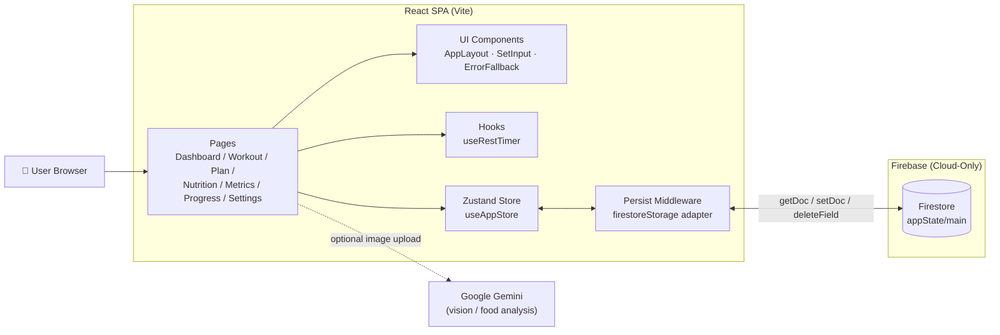
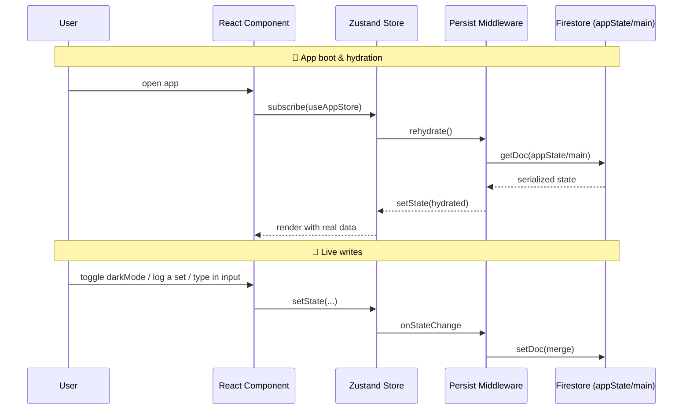
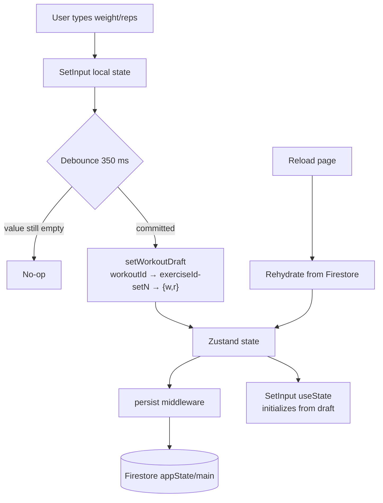
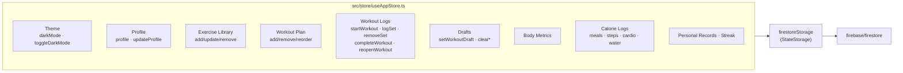
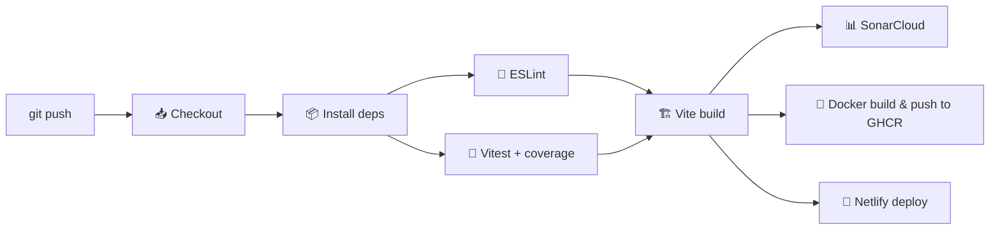

<div align="center">

# 💪 FitTracker

### A cloud-only, AI-assisted fitness tracker for body recomposition

**Track workouts • Log calories with AI • Monitor body metrics • See your progress**

[](https://github.com/utkarsh-gt7/mytrainer/actions/workflows/ci.yml)
[](https://mytrainer707.netlify.app)


[Live Demo](https://mytrainer707.netlify.app) · [Report Bug](https://github.com/utkarsh-gt7/mytrainer/issues) · [Request Feature](https://github.com/utkarsh-gt7/mytrainer/issues)

</div>

---

## 📑 Table of Contents

- [Overview](#-overview)
- [Features](#-features)
- [High-Level Design](#-high-level-design)
- [Tech Stack](#-tech-stack)
- [Project Structure](#-project-structure)
- [Getting Started](#-getting-started)
- [Environment Variables](#-environment-variables)
- [How to Use](#-how-to-use)
- [Testing & Coverage](#-testing--coverage)
- [CI/CD Pipeline](#-cicd-pipeline)
- [Deployment](#-deployment)
- [Available Scripts](#-available-scripts)
- [Troubleshooting](#-troubleshooting)
- [Roadmap](#-roadmap)
- [License](#-license)

---

## 🌟 Overview

**FitTracker** is a modern, mobile-first fitness tracking Progressive Web App designed for serious recomposition goals. It combines a beautifully-designed workout UI with cloud-native persistence and AI-powered nutrition logging.

> 🔒 **Cloud-only persistence** — every piece of state (profile, plan, logs, drafts) lives in **Firebase Firestore** under a single document (`appState/main`). There is no local storage fallback, so your data follows you on every device you sign in from.

> ✍️ **Draft autosave** — in-progress set weights and reps are persisted in real time. Reload the page mid-workout and nothing is lost.

---

## ✨ Features

### 🏋️ Training
- **6-Day Push / Pull / Legs plan** pre-loaded and fully editable
- **Active workout flow** with timer, rest timer, and per-set logging
- **Mobile-safe set rows** — tick/edit/copy buttons never get clipped on small screens
- **Clever "copy previous set"** button — one tap to prefill weight and reps from the set above
- **Per-set editing** — change any logged set after saving, without losing your PRs
- **Re-open completed workouts** to amend anything on today's session
- **Automatic PR detection** and history

### 🥗 Nutrition
- **Manual food logging** with macros and portion control
- **AI food-image analysis** via Google Gemini Vision (optional)
- **Steps, cardio minutes, and water intake** per day

### 📊 Analytics
- **Dashboard** with streak, PRs, and this-week summary
- **Progress page** with weekly workout, calorie, and weight-trend charts
- **Body metrics** with BMI, body fat, and measurement history

### 🎨 UX
- **Dark mode** by default, full light-mode support
- **Responsive layout** — sidebar on desktop, bottom nav on mobile
- **Error boundaries** with friendly "Firebase required" / "Reload app" fallbacks
- **PWA-ready** installable build

---

## 🏗 High-Level Design

### Architecture Overview



### State & Persistence Flow



### In-Progress Draft Recovery



### Store Module Layout



---

## 🧱 Tech Stack

| Layer | Technology |
|-------|------------|
| **Framework** | React 19 + TypeScript 6 |
| **Build Tool** | Vite 8 |
| **Styling** | TailwindCSS 3 + `clsx` + `tailwind-merge` |
| **State** | Zustand 5 (with `persist` middleware, cloud adapter) |
| **Cloud** | Firebase Firestore (sole persistence layer) |
| **AI** | Google Gemini (`@google/generative-ai`) |
| **Charts** | Recharts |
| **Icons** | Lucide React |
| **Routing** | React Router DOM 7 |
| **Testing** | Vitest 4 + React Testing Library + jsdom |
| **Coverage** | `@vitest/coverage-v8` |
| **CI/CD** | GitHub Actions + SonarCloud + Netlify |

---

## 📂 Project Structure

```
fitness-tracker/
├── .github/workflows/         CI/CD pipeline (lint, test, build, deploy)
├── src/
│   ├── components/
│   │   ├── AppErrorBoundary.tsx
│   │   ├── ErrorFallback.tsx
│   │   └── layout/            AppLayout with sidebar + bottom nav
│   ├── data/
│   │   ├── defaultPlan.ts     6-day PPL template
│   │   └── exercises.ts       Exercise database
│   ├── hooks/
│   │   └── useRestTimer.ts    Countdown timer with audio ping
│   ├── pages/
│   │   ├── Dashboard.tsx
│   │   ├── TodayWorkout.tsx   Active workout, drafts, edit-mode
│   │   ├── WeeklyPlan.tsx
│   │   ├── ExerciseLibrary.tsx
│   │   ├── BodyMetrics.tsx
│   │   ├── CalorieTracker.tsx
│   │   ├── Progress.tsx
│   │   └── Settings.tsx
│   ├── services/
│   │   ├── firebase.ts        Firestore client + isFirebaseConfigured
│   │   ├── gemini.ts          AI food analysis (optional)
│   │   └── localStorage.ts    Cloud-only stub (throws if called)
│   ├── store/
│   │   └── useAppStore.ts     Zustand store + firestoreStorage adapter
│   ├── types/index.ts
│   ├── utils/
│   │   ├── calculations.ts
│   │   └── cn.ts
│   ├── __tests__/             11 test suites · 164 tests
│   ├── App.tsx
│   └── main.tsx
├── netlify.toml
├── vite.config.ts
├── tsconfig*.json
└── package.json
```

---

## 🚀 Getting Started

### Prerequisites

| Tool | Version |
|------|---------|
| Node.js | **≥ 20.x** (tested on 22) |
| npm | **≥ 10** |
| Firebase project | with **Firestore** enabled |

### 1. Clone & install

```bash
git clone https://github.com/utkarsh-gt7/mytrainer.git fitness-tracker
cd fitness-tracker
npm install
```

### 2. Configure Firebase (required — app is cloud-only)

1. Go to the [Firebase Console](https://console.firebase.google.com/) and create a project.
2. In **Project settings → General → Your apps**, register a **Web app** and copy the config values.
3. In the left sidebar, open **Firestore Database → Create database** (start in *test mode* for local dev).
4. Copy `.env.example` to `.env` and fill it in:

```env
VITE_FIREBASE_API_KEY=your_api_key
VITE_FIREBASE_AUTH_DOMAIN=your_project.firebaseapp.com
VITE_FIREBASE_PROJECT_ID=your_project_id
VITE_FIREBASE_STORAGE_BUCKET=your_project.appspot.com
VITE_FIREBASE_MESSAGING_SENDER_ID=000000000000
VITE_FIREBASE_APP_ID=1:000000000000:web:abcdef123456

# Optional — enables AI food image analysis
VITE_GEMINI_API_KEY=your_gemini_key
```

> ⚠️ The app will show a **"Firebase configuration required"** page if either `VITE_FIREBASE_API_KEY` or `VITE_FIREBASE_PROJECT_ID` is missing.

### 3. Run

```bash
# Dev server (Vite)
npm run dev

# Production build
npm run build

# Preview the built output
npm run preview

# Tests
npm run test
npm run test:coverage
```

### 4. (Optional) Docker

```bash
docker build -t fitness-tracker .
docker run -p 8080:80 fitness-tracker
```

---

## 🔐 Environment Variables

| Variable | Required | Purpose |
|----------|:--------:|---------|
| `VITE_FIREBASE_API_KEY` | ✅ | Firebase Web SDK key |
| `VITE_FIREBASE_PROJECT_ID` | ✅ | Firestore project ID |
| `VITE_FIREBASE_AUTH_DOMAIN` | ⚪ | Firebase auth domain |
| `VITE_FIREBASE_STORAGE_BUCKET` | ⚪ | Firebase storage bucket |
| `VITE_FIREBASE_MESSAGING_SENDER_ID` | ⚪ | FCM sender ID |
| `VITE_FIREBASE_APP_ID` | ⚪ | Firebase app ID |
| `VITE_GEMINI_API_KEY` | ⚪ | Enables AI food-image analysis; falls back to mock when unset |

> Vite inlines `VITE_*` variables at **build time**. After editing `.env`, restart the dev server or rebuild.

---

## 📖 How to Use

### Dashboard
Opens by default. Shows today's plan, streak, recent PRs, and a weekly summary.

### Today's Workout (`/today`)
1. Tap **Start Workout** — the first exercise auto-expands.
2. For each set, enter **weight** and **reps**, then press the **✓** tick button.
3. On sets 2+ an arrow-down button appears — tap it to copy weight and reps from the previous set.
4. After logging, each row becomes read-only with a **pencil** icon; tap it to edit.
5. Tap **Complete Workout** when done. Your streak updates automatically.
6. To change a saved session, press **Edit Workout** on the "Workout Complete" card to re-open it.

> 💡 Typing is **autosaved** — if you reload mid-workout your values come right back.

### Weekly Plan (`/plan`)
Pick a day to add, remove, or reorder exercises. Great for tweaking the default PPL split.

### Exercise Library (`/exercises`)
Full CRUD on your library, with search and muscle-group filters.

### Body Metrics (`/metrics`)
Log weight / body fat / measurements. BMI is computed automatically.

### Nutrition (`/nutrition`)
Add meals manually, or upload a food photo to get an AI estimate via Gemini. Also tracks water, cardio, and steps.

### Progress (`/progress`)
Charts for weekly workouts, calories, weight trend, and PR history.

### Settings (`/settings`)
Edit profile, toggle theme, export or clear all cloud data.

---

## 🧪 Testing & Coverage

All state logic and critical UI paths are covered by Vitest. Testing runs in a jsdom environment with React Testing Library.

### Running tests

```bash
npm run test            # run once
npm run test:watch      # watch mode
npm run test:coverage   # with V8 coverage reporter
```

### Latest run (164 tests · 11 suites)

| Metric | Result |
|--------|-------:|
| **Test files** | **11 passed** |
| **Tests** | **164 passed** |
| **Line coverage** | **🟢 100.00%** |
| **Statement coverage** | 🟢 98.43% |
| **Function coverage** | 🟢 99.39% |
| **Branch coverage** | 🟡 88.05% |

### Per-file coverage

| File | Stmts | Branch | Funcs | Lines |
|------|:-----:|:------:|:-----:|:-----:|
| `components/ErrorFallback.tsx` | 100% | 100% | 100% | **100%** |
| `data/defaultPlan.ts` | 100% | 100% | 100% | 100% |
| `data/exercises.ts` | 100% | 100% | 100% | 100% |
| `hooks/useRestTimer.ts` | 100% | 100% | 91.66% | 100% |
| `pages/TodayWorkout.tsx` | 96.00% | 85.58% | 100% | 100% |
| `services/firebase.ts` | 100% | 56.25% | 100% | 100% |
| `services/localStorage.ts` | 100% | 100% | 100% | 100% |
| `store/useAppStore.ts` | 99.04% | 90.81% | 100% | 100% |
| `utils/calculations.ts` | 100% | 100% | 100% | 100% |
| `utils/cn.ts` | 100% | 100% | 100% | 100% |

> Presentational pages (Dashboard, WeeklyPlan, ExerciseLibrary, BodyMetrics, CalorieTracker, Progress, Settings, AppLayout) are intentionally left out of the unit-test coverage because they render on top of the already fully-covered store, hooks, utilities and data — and are better verified with end-to-end tests.

### Test suites

| Suite | Tests | Focus |
|-------|:-----:|-------|
| `store.test.ts` | 52 | Zustand actions, drafts, streaks, PR detection, reopen |
| `calculations.test.ts` | 39 | BMI, BFE, calorie target, protein, formatters |
| `defaultPlan.test.ts` | 13 | Default PPL plan shape & constraints |
| `exercises.test.ts` | 11 | Exercise database integrity |
| `firestoreStorage.test.ts` | 11 | `getItem` / `setItem` / `removeItem` happy & error paths |
| `setInput.test.tsx` | 11 | Mobile layout, copy-previous, edit-mode, PR trophy |
| `todayWorkout.test.tsx` | 7 | Full page flow, draft persistence, reopen |
| `cn.test.ts` | 8 | `clsx` + `tailwind-merge` helper |
| `useRestTimer.test.ts` | 5 | Countdown, pause/resume, reset, progress |
| `localStorage.test.ts` | 4 | Cloud-only stub throws as expected |
| `app-fallback.test.tsx` | 3 | ErrorFallback SSR + reload click |

---

## 🔁 CI/CD Pipeline

GitHub Actions runs on every push and pull request to `main`.



**Required GitHub secrets**

| Secret | Purpose |
|--------|---------|
| `SONAR_TOKEN` | SonarCloud analysis |
| `NETLIFY_AUTH_TOKEN` | Netlify deploy token |
| `NETLIFY_SITE_ID` | Netlify site identifier |
| `VITE_FIREBASE_*` | Passed at build time |
| `VITE_GEMINI_API_KEY` | (optional) enables AI |

---

## 🌐 Deployment

### Netlify (current)
- `netlify.toml` declares `npm run build` and publishes `dist/`.
- SPA redirect to `/index.html` is preconfigured.
- Add the same `VITE_FIREBASE_*` env vars in **Site settings → Environment variables** and trigger a fresh deploy.

### Docker / GHCR
`Dockerfile` builds a multi-stage image and serves the static output via Nginx on port `80`.

### Self-hosted
Any static host works — just upload the `dist/` folder after `npm run build`.

---

## 📜 Available Scripts

| Script | Description |
|--------|-------------|
| `npm run dev` | Vite dev server on `http://localhost:5173` |
| `npm run build` | Type-check + production build into `dist/` |
| `npm run preview` | Preview the built `dist/` |
| `npm run lint` | ESLint (TypeScript + React Hooks rules) |
| `npm run test` | Vitest single run |
| `npm run test:watch` | Vitest watch mode |
| `npm run test:coverage` | Vitest + V8 coverage report |

---

## 🛠 Troubleshooting

<details>
<summary><strong>"Firebase configuration required" screen on load</strong></summary>

Your build does not have `VITE_FIREBASE_API_KEY` or `VITE_FIREBASE_PROJECT_ID`. Locally, add them to `.env` and restart the dev server. On Netlify, set them in Environment variables and redeploy.
</details>

<details>
<summary><strong>"Unable to load cloud data"</strong></summary>

Hydration from Firestore failed. Check that Firestore is enabled in your Firebase project and that the keys in `.env` match the project that owns the database.
</details>

<details>
<summary><strong>Netlify install fails with ERESOLVE / peer dependency errors</strong></summary>

This project targets **Vite 8**. Avoid adding plugins that still peer-require older Vite. Removing or upgrading the offending plugin resolves it.
</details>

<details>
<summary><strong>I lost the values I typed after a reload</strong></summary>

You shouldn't — every keystroke is debounced (350 ms) into `workoutDrafts` and stored in Firestore. If you unplug Wi-Fi while typing, the last successful cloud write is what you get back.
</details>

---

## 🗺 Roadmap

- [ ] Per-user Firebase Auth (currently single-doc multi-device)
- [ ] Apple Health / Google Fit import
- [ ] Rest-timer customization per exercise
- [ ] Shareable PR cards
- [ ] Offline-first queue (still cloud-primary, but survives disconnects)

---

## 📄 License

[MIT](./LICENSE) © Utkarsh
